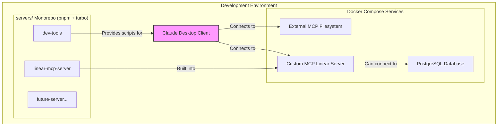

# Architecture

This document provides a high-level overview of the Omni MCP project architecture, its components, and the development workflow.

## Guiding Principles

- **Hybrid Approach**: The project integrates both custom-built MCP servers and external, pre-built Docker-based servers.
- **Scalable Monorepo**: Custom servers are managed in a `pnpm` monorepo using `Turborepo` to ensure fast, consistent, and scalable development.
- **Developer Experience**: The entire setup is optimized for a smooth developer experience with automated scripts, clear documentation, and a unified command interface.

## System Diagram

## Directory Structure

| Path                   | Description                                                                                                                                                |
| ---------------------- | ---------------------------------------------------------------------------------------------------------------------------------------------------------- |
| `client-integrations/` | Contains configuration files for client applications like Claude Desktop. The `.local.json` file is for local overrides and is watched for auto-reloading. |
| `compose/`             | Contains configuration for non-service components, like the `database-tools.yaml` used by Google's MCP Toolbox.                                            |
| `data/`                | Holds data used by services, such as sample SQL data or files for the filesystem server.                                                                   |
| `deployment/`          | Contains Docker Compose files. `docker-compose.yml` is for base services, and `docker-compose.dev.yml` is for development-specific services.               |
| `scripts/`             | Contains shell scripts for setup or other repository-level tasks.                                                                                          |
| `secrets/`             | Stores sensitive information like API keys, intended to be used via `.env` files and not committed to git.                                                 |
| `servers/`             | The heart of the custom development, a `pnpm` monorepo for all custom TypeScript MCP servers.                                                              |

## Development Workflow

### Running Services

The entire development environment can be managed with Docker Compose:

- **Start all services**: `docker compose -f deployment/docker-compose.yml -f deployment/docker-compose.dev.yml up -d`
- **Stop all services**: `docker compose -f deployment/docker-compose.yml -f deployment/docker-compose.dev.yml down`

### Custom Server Development

All custom servers are located in the `servers/` directory and managed by `pnpm` and `Turborepo`.

- **Install dependencies**: `cd servers && pnpm install`
- **Run all servers in dev mode**: `pnpm dev`
- **Build all servers**: `pnpm build`

For detailed instructions on adding a new server, see `servers/README.md`.
