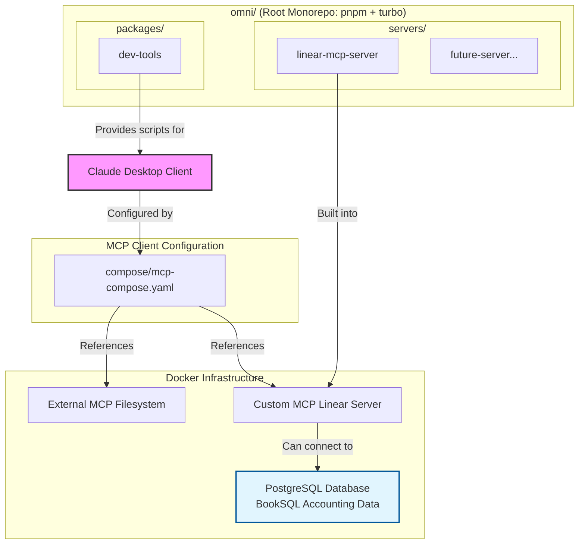

# Architecture

This document provides a high-level overview of the Omni MCP project architecture, its components, and the development workflow.

## Guiding Principles

- **Hybrid Approach**: The project integrates both custom-built MCP servers and external, pre-built Docker-based servers.
- **Scalable Monorepo**: Custom servers are managed in a `pnpm` monorepo using `Turborepo` to ensure fast, consistent, and scalable development.
- **Developer Experience**: The entire setup is optimized for a smooth developer experience with automated scripts, clear documentation, and a unified command interface.
- **Clear Separation**: Docker configurations are organized by purpose (base infrastructure, development, production).
- **Unified Build System**: Single commands handle both TypeScript compilation and Docker image building.
- **Rich Data**: Uses the BookSQL accounting database for realistic business scenarios and complex queries.

## System Diagram



## Directory Structure

| Path                                | Description                                                                    |
| ----------------------------------- | ------------------------------------------------------------------------------ |
| `client-integrations/`              | Configuration files for client applications like Claude Desktop.               |
| `compose/`                          | **MCP-specific configuration** using MCP protocol schema (not Docker Compose). |
| `data/`                             | Data used by services (SQL samples, file storage).                             |
| `data/booksql/`                     | **BookSQL accounting database** schema and sample data.                        |
| `deployment/`                       | **Docker Compose files** for infrastructure deployment.                        |
| `deployment/docker-compose.yml`     | Base infrastructure services (PostgreSQL with BookSQL, networks, volumes).     |
| `deployment/docker-compose.dev.yml` | Development-specific service overrides.                                        |
| `packages/`                         | Utility packages and tools (not MCP servers).                                  |
| `scripts/`                          | Repository-level setup and maintenance scripts.                                |
| `secrets/`                          | Sensitive configuration files (API keys, credentials).                         |
| `servers/`                          | Custom TypeScript MCP servers in a pnpm workspace.                             |
| `package.json`                      | Root monorepo configuration.                                                   |
| `pnpm-workspace.yaml`               | Defines monorepo workspaces (`packages/*` and `servers/*`).                    |
| `turbo.json`                        | Turborepo pipeline configuration.                                              |

## BookSQL Database

The project uses the [BookSQL dataset](https://github.com/Exploration-Lab/BookSQL/tree/main/DATA), a comprehensive accounting domain database with 7 interconnected tables:

- **`master_txn_table`** - All business transactions (invoices, payments, expenses)
- **`customers`** - Customer information and balances
- **`vendors`** - Vendor information and outstanding balances
- **`employees`** - Employee data and billing rates
- **`products`** - Products and services offered
- **`chart_of_accounts`** - Chart of accounts (assets, liabilities, income, expenses)
- **`payment_method`** - Available payment methods

This provides rich, realistic data for complex business queries including:

- Revenue analysis by product/service
- Customer balance tracking
- Vendor payment management
- Cash flow analysis
- Overdue invoice reporting
- Account summaries

## Development Workflow

### Unified Build System

The project features a comprehensive build system that handles both TypeScript compilation and Docker image management:

**Build Everything:**

```bash
pnpm build:all          # Build TypeScript + Docker images + Pull external images
```

**Individual Build Commands:**

```bash
pnpm build              # Build only TypeScript packages (via Turborepo)
pnpm build:docker       # Build only custom Docker images
pnpm build:docker:all   # Build custom Docker images + pull external images
pnpm pull:docker        # Pull external Docker images only
```

### Running Docker Services

The development environment uses layered Docker Compose files:

- **Start all services**: `docker compose -f deployment/docker-compose.yml -f deployment/docker-compose.dev.yml up -d`
- **Stop all services**: `docker compose -f deployment/docker-compose.yml -f deployment/docker-compose.dev.yml down`

### MCP Client Configuration

The `compose/mcp-compose.yaml` file uses the MCP protocol schema (not Docker Compose) and defines how Claude Desktop launches MCP servers.

### Monorepo Development

All custom packages are managed by `pnpm` and `Turborepo` from the project root:

- **Install dependencies**: `pnpm install`
- **Run dev mode**: `pnpm dev`
- **Build all packages**: `pnpm build`
- **Run file watcher**: `pnpm watch:config`
- **Run specific package**: `pnpm --filter <package-name> <script>`

### Cleaning Up

```bash
pnpm clean              # Clean TypeScript build artifacts
pnpm clean:docker       # Clean Docker system (remove unused images/containers)
pnpm clean:all          # Clean everything
```

For detailed instructions on adding a new server, see `servers/README.md`.

## Deployment Configurations

### Docker Compose (Infrastructure)

- **Base**: `deployment/docker-compose.yml` - Core services
- **Development**: `deployment/docker-compose.dev.yml` - Dev overrides
- **Production**: `deployment/docker-compose.prod.yml` - Prod overrides (TODO)

### MCP Protocol

- **Client Config**: `compose/mcp-compose.yaml` - How Claude Desktop launches servers

### Cloud Deployments

- **Fly.io**: `deployment/fly/` - Fly.io deployment configurations
- **Kubernetes**: `deployment/kubernetes/` - K8s deployment manifests

## Build Pipeline

The unified build system follows this pipeline:

1. **TypeScript Compilation** (via Turborepo)
   - Builds all packages in `packages/` and `servers/`
   - Uses intelligent caching for fast rebuilds
2. **External Image Management**
   - Pulls latest versions of external Docker images
   - Handles authentication for private registries
3. **Custom Docker Builds**
   - Builds Docker images for custom MCP servers
   - Uses monorepo context for efficient builds

This ensures that a single `pnpm build:all` command prepares your entire development environment.
