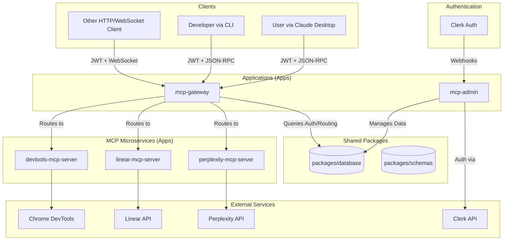

# Omni: System Architecture

This document provides a high-level overview of the Omni system architecture, which is designed as a
scalable, maintainable, and extensible monorepo.

## 🏛️ Core Philosophy

The architecture is built on three primary concepts:

1.  **The Gateway Pattern**: A central `mcp-gateway` acts as the single entry point for all clients.
    It is responsible for routing, authentication, and session management.
2.  **The MCP Server Pattern**: Independent, single-purpose microservices called "MCP Servers"
    provide specific capabilities (e.g., interacting with the Linear API).
3.  **Shared Database**: A single, shared `database` package manages the Prisma schema, client, and
    migrations, ensuring data consistency across the platform.

This separation of concerns allows for modular development, independent deployments, and clear
ownership of services.

## Diagram

## 🧩 Components

### 1. The Monorepo (`omni`)

The entire system is housed in a `pnpm` and `turborepo` powered monorepo.

- **`apps/`**: Contains the runnable applications (`gateway`, `mcp-admin`, `linear-mcp-server`,
  etc.).
- **`packages/`**: Contains shared code used across applications:
  - **`database`**: The central source of truth for all data. Manages the Prisma schema, database
    migrations, and exports a singleton Prisma Client for all apps to use.
  - `schemas`: Shared TypeScript interfaces and Zod validation schemas.
  - `capabilities`: Capability definitions for the MCP ecosystem.
  - `utils`: Common utilities like logging and error handling.
- **`docs/`**: Project documentation, including this document.

### 2. The Gateway (`apps/gateway`)

The `mcp-gateway` is the brain of the system.

- **Service Discovery**: Reads configuration to know about all available MCP servers.
- **Health Checking**: Periodically polls MCP servers to ensure they are online and healthy.
- **Organization-Based Routing**: Before routing, it queries the shared `database` to verify which
  MCP servers an organization is permitted to access.
- **Capability Routing**: Routes incoming requests to the appropriate, healthy MCP server based on
  the requested tool or resource.
- **Protocol Abstraction**: Handles both HTTP and WebSocket connections.
- **Authentication**: Validates JWTs from clients.

### 3. Admin Application (`apps/mcp-admin`)

A Next.js application for multi-tenant administration.

- **Database Interaction**: Uses the shared `@mcp/database` package to manage organizations, users,
  and service enablement.
- **Clerk Integration**: Seamless authentication with webhook synchronization for users and
  organizations, keeping the database in sync with Clerk.
- **Service Management**: Provides a UI for administrators to enable/disable MCP servers for each
  organization.

### 4. Database Package (`packages/database`)

The single source of truth for data persistence.

- **Prisma Schema**: Contains the `schema.prisma` file that defines all database models and
  relations.
- **Generated Client**: Exports a singleton, generated Prisma Client that is imported by all other
  apps (`mcp-admin`, `gateway`, etc.) to interact with the database.
- **Migrations**: Manages all database migration files.
- **Seeding**: Contains scripts to seed the database with initial data (e.g., default MCP servers).

### 5. MCP Servers (`apps/*-mcp-server`)

These are the workhorses, built following the `MCP_SERVER_PATTERN.md` guide.

- **Standardized Structure**: Each server has a consistent layout, making them predictable and easy
  to develop.
- **Single Responsibility**: Each server has a clear purpose, such as interacting with a specific
  third-party API.
  - `devtools-mcp-server`: Browser automation.
  - `linear-mcp-server`: Linear API interaction.
  - `perplexity-mcp-server`: AI-powered search.

## 🚀 Workflow: A Tool Call Example

1.  A client sends an HTTP POST request to the `mcp-gateway` with a JWT to call a tool.
2.  The `MCPGateway` receives the request and validates the JWT.
3.  It extracts the organization ID from the token and queries the `@mcp/database` to get the list
    of enabled MCP servers for that organization.
4.  The gateway determines the request is for the `linear_search` tool, which is provided by the
    `linear-mcp-server`.
5.  It checks if the organization has access to `linear-mcp-server`. If not, it returns an access
    denied error.
6.  The `ServerManager` confirms the `linear-mcp-server` is healthy.
7.  The gateway proxies the request to the `linear-mcp-server`.
8.  The `linear-mcp-server` handler executes the business logic (calls the Linear API) and returns
    the result.
9.  The gateway forwards the response back to the client.
