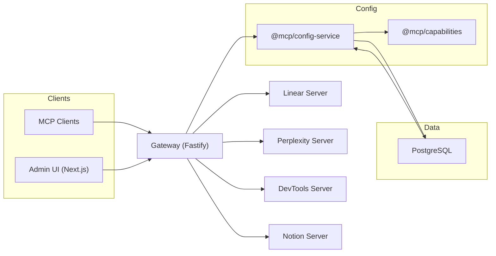

# Omni MCP Platform — Current Architecture

> Concise, current description of the system and MCP server patterns. No historical references.

## Overview

- Clients (Cursor/Claude/etc.) → Gateway (Fastify) → MCP Servers (Linear, Perplexity, DevTools,
  Notion)
- Configuration for prompts/resources is database-driven via `@mcp/config-service`
- TypeScript ESM (NodeNext) everywhere; cross-package imports use package names (`@mcp/...`)

### High‑Level Diagram

## Components

### Gateway (`apps/gateway/`)

- Protocol adaptation (HTTP/JSON-RPC ⇄ MCP), routing, organization context, security (headers, CORS,
  rate-limit, API key)
- Loads runtime server config from `@mcp/config-service` (`buildMCPServersConfig`)
- Discovers server definitions from `@mcp/capabilities`
- Port: 37373

## MCP Servers (`apps/*-mcp-server/`)

Shared pattern via `@mcp/server-core`:

- Tools: static business logic handlers per server
- Prompts/Resources: dynamic per-organization via `@mcp/config-service`
- Creation variants:
  - `createMcpServerWithClient` (e.g., Linear)
  - `createMcpServerWithoutClient` (e.g., Perplexity)

For the complete MCP server pattern, see `docs/MCP_SERVER_PATTERN.md`.

### Config Service (`@mcp/config-service`)

- `ConfigLoader` loads prompts/resources with LRU caching
- `buildMCPServersConfig` builds the Gateway’s runtime map (URLs, capabilities)

### Capabilities (`@mcp/capabilities`)

- Central registry for server definitions (name, port, env var, tools/resources/prompts)

### Database (`@mcp/database`)

- PostgreSQL via Prisma; generated client available at `@mcp/database/client`

### Admin UI (`apps/mcp-admin/`)

- Next.js App Router for org management and real-time testing

## Conventions

- ESM + NodeNext; cross-package imports via `@mcp/...`; intra-package relative imports include `.js`
- Strict TypeScript; prefer structural types for DB payloads
- `@mcp/database` runs `prisma generate` before build

## Dev Commands

- `pnpm dev` — run dev
- `pnpm build` — build all packages
- `pnpm -F @mcp/database db:*` — Prisma (generate/migrate/seed)

## Summary

- Gateway routes/secure requests
- Servers use a unified pattern with dynamic prompts/resources
- Config service and capabilities provide single source of truth
- Consistent ESM and package-name imports across the monorepo
