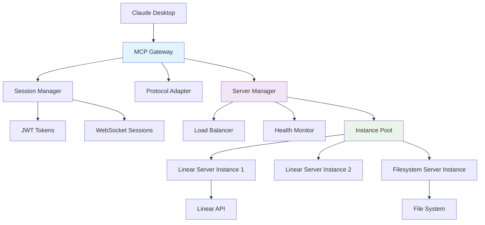
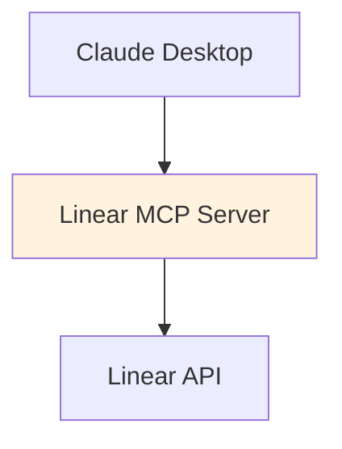

# Claude Desktop MCP Routing Guide

## 🔀 **Modern Gateway Architecture**

The MCP Gateway now uses **on-demand server spawning** with intelligent load balancing and session management, providing both production-grade reliability and development efficiency.

### **Current Request Flow**

```
Claude Desktop → MCP Gateway → Server Manager → MCP Server Instance
     ↓              ↓              ↓                    ↓
  JSON-RPC      Session Mgmt   Load Balancer       Linear API
                   ↓              ↓                    ↓
               JWT Tokens    Health Checks         Response
```

## 🏗️ **Gateway Components**

### **1. MCP Gateway Core**

- **Protocol Adaptation**: Converts between HTTP/WebSocket and MCP JSON-RPC
- **Request Routing**: Maps capabilities to appropriate servers
- **Session Management**: JWT-based authentication and state tracking

### **2. Server Manager**

- **On-Demand Spawning**: Creates server instances as needed
- **Load Balancing**: Least-connections algorithm for optimal distribution
- **Health Monitoring**: Automatic instance recovery and replacement
- **Environment Isolation**: Secure environment variable management

### **3. Session Manager**

- **Multi-Protocol Support**: HTTP and WebSocket connections
- **Token Management**: JWT-based session authentication
- **Concurrent Limits**: Configurable session limits for resource control

## 🔧 **Configuration Commands**

| Command                      | Description                 | Use Case                      |
| ---------------------------- | --------------------------- | ----------------------------- |
| `make claude-config-dev`     | **Gateway (Default)**       | Standard local development    |
| `make claude-config-gateway` | All through gateway         | Alias for `claude-config-dev` |
| `make claude-config-direct`  | Direct connection to Linear | For isolated server debugging |
| `make claude-config-prod`    | Docker containers           | Production deployment         |

## 📊 **Monitoring Commands**

| Command             | Purpose                | Shows                             |
| ------------------- | ---------------------- | --------------------------------- |
| `make logs`         | All services real-time | Docker services with timestamps   |
| `make logs-local`   | Local server help      | Instructions for local monitoring |
| `make tail`         | Everything live        | Real-time tail of all activity    |
| `make test-all-mcp` | Test all servers       | Manual MCP server testing         |

## 🚀 **Modern Request Flow Details**

### **1. Client Connection**

```
Claude Desktop → Gateway (HTTP/WebSocket)
  ↓
Session Creation (JWT token issued)
  ↓
Capability Resolution (method → server mapping)
```

### **2. Server Instance Management**

```
Server Manager checks available instances
  ↓
If no healthy instances: Spawn new server process
  ↓
Load balancer selects least-busy instance
  ↓
MCP handshake validation (10s timeout)
```

### **3. Request Execution**

```
Protocol Adapter sends JSON-RPC to server instance
  ↓
Server processes request (Linear API, filesystem, etc.)
  ↓
Response flows back through gateway to client
  ↓
Instance released back to pool
```

### **4. Health & Recovery**

```
Continuous health checks every 30s
  ↓
Failed instances automatically terminated
  ↓
New instances spawned to maintain minimum pool
  ↓
Load balancer routes around unhealthy instances
```

## 🧪 **Testing Request Flow**

### **Test Gateway Routing (Default)**

```bash
# Terminal 1: Start all services including gateway
make dev

# Terminal 2: Real-time monitoring with detailed logs
make tail

# Terminal 3: Check gateway health
curl http://localhost:37373/health

# Claude Desktop: Try MCP requests:
# - "Search Linear issues for Phoenix team"
# - "List files in the current directory"
```

**What you'll see in logs:**

1. Session creation and JWT token generation
2. Capability resolution (method → server mapping)
3. Server instance spawning (if needed)
4. MCP handshake completion
5. Request routing and execution
6. Load balancing decisions
7. Health check results

### **Test Direct Connection (For Debugging)**

```bash
# Terminal 1: Switch to direct config
make claude-config-direct

# Terminal 2: Monitor local server logs
make logs-local

# Claude Desktop: Same MCP requests
# You'll see: Direct connection without gateway overhead
```

## 🔍 **Request Flow Visualization**

### **Gateway Architecture (Production & Development)**



### **Direct Connection (Debugging Only)**



## 🔧 **Environment & Configuration**

### **Gateway Environment**

- **Centralized Config**: `shared/utils/src/env.ts`
- **Environment Files**: `.env.development.local` (secrets)
- **Security**: Servers manage their own API keys
- **Timeouts**: Configurable MCP handshake timeouts

### **Server Spawning**

- **On-Demand**: Servers created when first request arrives
- **Pooling**: Multiple instances for load distribution
- **Recovery**: Failed instances automatically replaced
- **Resource Limits**: Configurable max instances per server

## 🚀 **Recommended Development Workflow**

### **1. Default Development (Gateway)**

```bash
make dev              # Start all services
make claude-config-dev # Configure Claude Desktop
make tail             # Monitor everything in real-time
```

**Benefits**: Production parity, centralized logging, load balancing, session management

### **2. Isolated Debugging (Direct)**

```bash
make claude-config-direct  # Bypass gateway
make logs-local           # Monitor individual server
```

**Benefits**: Simpler debugging, direct server logs, faster iteration

### **3. Production Testing**

```bash
make claude-config-prod   # Use Docker containers
make logs                # Monitor containerized services
```

**Benefits**: Full production environment simulation

## 📈 **Performance & Monitoring**

### **Gateway Metrics**

- **Session Count**: Active JWT sessions
- **Instance Health**: Server availability per type
- **Load Distribution**: Requests per server instance
- **Response Times**: End-to-end latency

### **Health Endpoints**

- **Gateway Health**: `http://localhost:37373/health`
- **Server Status**: Instance counts and capabilities
- **Real-time Monitoring**: WebSocket connection for live updates

## 🛠️ **Troubleshooting**

### **Common Issues**

1. **MCP Handshake Timeouts**

   - Check server environment variables
   - Verify server executable paths
   - Review gateway logs for spawn errors

2. **No Healthy Instances**

   - Check server-specific environment files
   - Verify API keys are properly configured
   - Monitor health check intervals

3. **Session Management Issues**
   - Verify JWT secret configuration
   - Check session timeout settings
   - Monitor concurrent session limits

### **Debug Commands**

```bash
# Check gateway configuration
cat gateway/master.config.dev.json

# Monitor server spawning
make tail | grep "server-manager"

# Test MCP handshake manually
make test-all-mcp

# Check environment variables
make env-debug
```
