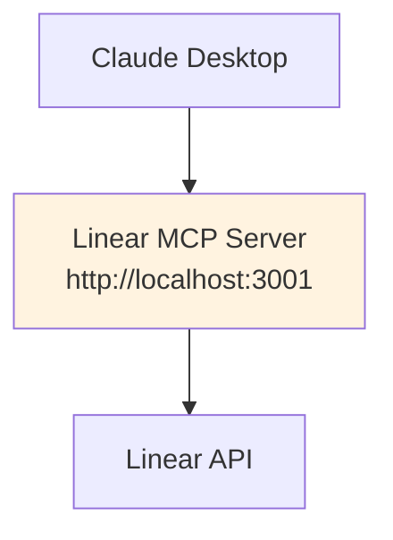

# Claude Desktop MCP Routing Guide

## 🔀 **Modern Gateway Architecture**

The MCP Gateway now operates as a **robust, network-based reverse proxy**. It provides a single, stable endpoint for clients and intelligently routes requests to the appropriate backend MCP microservices. This architecture is built for scalability, reliability, and production-grade performance.

### **Current Request Flow**

```
Claude Desktop → MCP Gateway → MCP Server (via HTTP)
     ↓              ↓                    ↓
  JSON-RPC     Health Checks &     Linear API, etc.
 (HTTP/WS)     Request Routing         ↓
     ↓                               Response
   Session
 Management
 (JWT)
```

## 🏗️ **Gateway Components**

### **1. MCP Gateway Core**

- **Protocol Adaptation**: Converts between client-facing HTTP/WebSocket and backend MCP HTTP requests.
- **Request Routing**: Maps capabilities defined in `@mcp/utils/env.ts` to the correct server URL.
- **Session Management**: Issues JWTs to track client sessions.

### **2. Server Manager**

- **Network Health Monitoring**: Periodically sends HTTP GET requests to each server's `/health` endpoint. Unhealthy servers are temporarily removed from the routing pool.
- **Configuration-Driven**: Manages a static list of servers defined in the `getMCPServersConfig` function in `@mcp/utils/env.ts`.
- **Load Balancing**: (Future) Can be extended to support multiple instances per service for load balancing.

### **3. Session Manager**

- **Multi-Protocol Support**: Handles standard HTTP and WebSocket connections.
- **Token Management**: JWT-based session authentication.
- **Concurrent Limits**: Configurable session limits for resource control.

## 🔧 **Configuration & Monitoring**

The project uses `pnpm` scripts for managing development, configuration, and monitoring tasks. Refer to the root `package.json` for a complete list of commands.

| Command             | Description                                              |
| ------------------- | -------------------------------------------------------- |
| `pnpm dev`          | Starts all services in development mode with hot-reload. |
| `pnpm build`        | Builds all packages and apps for production.             |
| `pnpm omni list`    | Lists all available MCP servers.                         |
| `pnpm watch:config` | Watches for changes in Claude config files.              |

## 🚀 **Modern Request Flow Details**

### **1. Client Connection**

```
Claude Desktop → Gateway (HTTP/WebSocket on port 37373)
  ↓
Session Creation (JWT token issued)
  ↓
Capability Resolution (e.g., "linear_get_teams" maps to the Linear server URL defined in the gateway's config)
```

### **2. Server Request**

```
Gateway sends HTTP POST to http://linear-mcp-server:3001/mcp
  ↓
Request contains the original JSON-RPC payload
  ↓
30-second timeout managed by the gateway
```

### **3. Request Execution**

```
Linear MCP Server receives request at its /mcp endpoint
  ↓
Server processes request (e.g., calls the actual Linear API)
  ↓
Response flows back through gateway to the client
```

### **4. Health & Recovery**

```
Gateway sends GET request to http://linear-mcp-server:3001/health every 30s
  ↓
If a server fails the health check, the gateway stops routing requests to it.
  ↓
When the server becomes healthy again, the gateway resumes routing.
```

## 🧪 **Testing Request Flow**

### **Test Gateway Routing (Default)**

```bash
# Terminal 1: Start all services
pnpm dev

# Terminal 2: Check gateway health (includes backend server status)
curl http://localhost:37373/health | jq

# Terminal 3: Make a request through the gateway
curl -X POST http://localhost:37373/mcp -d '{"jsonrpc": "2.0", "method": "tools/call", "params": {"name": "linear_get_teams"}, "id": 1}'

# Claude Desktop: Try MCP requests:
# - "Search Linear issues for Phoenix team"
# - "Look up customer 'MARY SMITH'"
```

**What you'll see in logs:**

1.  Session creation and JWT token generation.
2.  Gateway logging the request and which server URL it's proxying to.
3.  Linear MCP server logging the incoming request.
4.  Health check results appearing periodically.

## 🔍 **Request Flow Visualization**

### **Gateway Architecture (Production & Development)**

```mermaid
graph TD
    A[Claude Desktop] --> B{MCP Gateway<br/>(Reverse Proxy)}
    B --> |HTTP POST to /mcp| K[Linear MCP Server<br/>http://...:3001]
    B --> |HTTP POST to /mcp| M[Query Quill MCP Server<br/>http://...:3002]
    B --> |...| O[Other MCP Servers]

    subgraph "Gateway Health Checks"
      direction LR
      B-.->|GET /health| K
      B-.->|GET /health| M
      B-.->|GET /health| O
    end

    K --> N[Linear API]
    M --> P[Pagila Database]

    style B fill:#e1f5fe,stroke:#333,stroke-width:2px
    style K fill:#e8f5e8,stroke:#333,stroke-width:1px
    style M fill:#e8f5e8,stroke:#333,stroke-width:1px
    style O fill:#e8f5e8,stroke:#333,stroke-width:1px
```

### **Direct Connection (Debugging Only)**

This remains a useful pattern for isolating a single server.



## 🔧 **Environment & Configuration**

### **Gateway Environment**

- **Centralized Config**: Server URLs are defined in `@mcp/utils/env.ts`.
- **Security**: Servers still manage their own API keys, loaded via their own `.env` files.
- **Timeouts**: Network timeouts are handled gracefully by the gateway.

### **Server Configuration (No more spawning)**

- **Static URLs**: Servers are defined by their network address in the gateway config.
- **Container Networking**: Docker's networking resolves hostnames (e.g., `http://linear-mcp-server:3001`).
- **Health Checks**: The `/health` endpoint is critical for a server to be considered "online" by the gateway.

## 🚀 **Recommended Development Workflow**

### **1. Default Development (Gateway)**

```bash
pnpm dev              # Start all services
pnpm watch:config     # Configure Claude Desktop and watch for changes
# Monitor service logs in the terminal where "pnpm dev" is running
```

**Benefits**: Production parity, centralized logging, load balancing, session management

### **2. Isolated Debugging (Direct)**

```bash
make claude-config-direct  # Bypass gateway
make logs-local           # Monitor individual server
```

**Benefits**: Simpler debugging, direct server logs, faster iteration

### **3. Production Testing**

```bash
make claude-config-prod   # Use Docker containers
make logs                # Monitor containerized services
```

**Benefits**: Full production environment simulation

## 📈 **Performance & Monitoring**

### **Gateway Metrics**

- **Session Count**: Active JWT sessions
- **Instance Health**: Server availability per type
- **Load Distribution**: Requests per server instance
- **Response Times**: End-to-end latency

### **Health Endpoints**

- **Gateway Health**: `http://localhost:37373/health`
- **Server Status**: Instance counts and capabilities
- **Real-time Monitoring**: WebSocket connection for live updates

## 🛠️ **Troubleshooting**

### **Common Issues**

1.  **Server Unhealthy in Gateway**

    - `curl http://localhost:3001/health` directly. Does it return `{"status":"ok"}`?
    - Check the server logs from the `pnpm dev` output for errors on startup.
    - Ensure the server's `PORT` in its `.env` file matches the port used in the gateway's configuration.

2.  **Gateway Request Fails (e.g., 500 error)**

    - Check the gateway logs from the `pnpm dev` output. It will show the proxy error.
    - Check the target server's logs. It might be crashing when handling the request.
    - The server's API key might be missing or invalid.

3.  **Connection Refused**
    - Are all services running correctly in the `pnpm dev` output?
    - Are the ports configured correctly and free on your machine?

### **Debug Commands**

```bash
# Check gateway configuration by inspecting:
# packages/utils/src/env.ts

# Test a server directly
curl -X POST http://localhost:3001/mcp -d '{"jsonrpc": "2.0", "method": "tools/call", "params": {"name": "linear_get_teams"}, "id": 1}'

# Check environment variables loaded for a specific service by adding logs to its config file.
```
