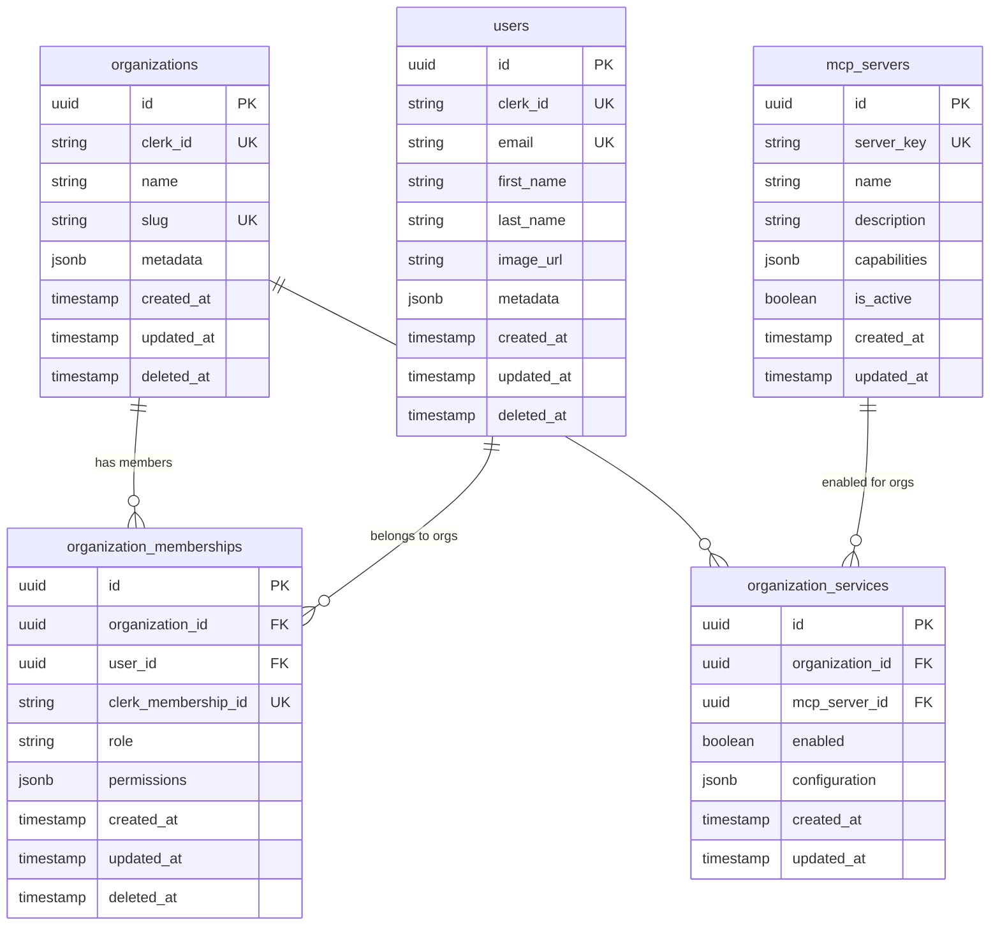
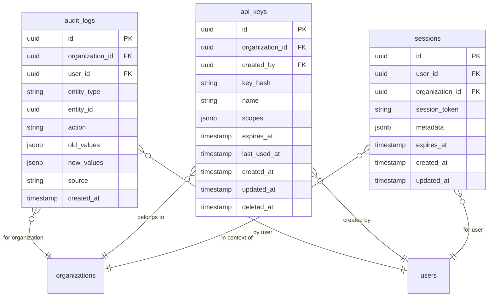

# Multi-Tenant Database Schema Design

## Overview

This document defines the database schema for the multi-tenant MCP (Model Context Protocol)
platform. The schema supports organization-based service enablement, role-based access control, and
seamless integration with Clerk authentication.

## Core Design Principles

1. **Organization-Centric Multi-Tenancy**: Organizations are the primary tenant boundary
2. **Service Enablement**: Fine-grained control over which MCP servers each organization can access
3. **Role-Based Access**: Flexible permission system within organizations
4. **Audit Trail**: Complete history of changes for compliance and debugging
5. **Clerk Integration**: Seamless synchronization with Clerk via webhooks
6. **Performance**: Optimized indexes and queries for high-performance operations

## Schema Diagrams

### Core Entity Relationships



### Audit Trail System



## Table Definitions

### Core Tables

#### `organizations`

Primary tenant entity for multi-tenancy.

```sql
CREATE TABLE organizations (
    id UUID PRIMARY KEY DEFAULT gen_random_uuid(),
    clerk_id TEXT UNIQUE NOT NULL,
    name TEXT NOT NULL,
    slug TEXT UNIQUE NOT NULL,
    metadata JSONB DEFAULT '{}',
    created_at TIMESTAMP WITH TIME ZONE DEFAULT NOW(),
    updated_at TIMESTAMP WITH TIME ZONE DEFAULT NOW(),
    deleted_at TIMESTAMP WITH TIME ZONE,

    CONSTRAINT organizations_slug_format CHECK (slug ~ '^[a-z0-9-]+$')
);

-- Indexes
CREATE INDEX idx_organizations_clerk_id ON organizations(clerk_id);
CREATE INDEX idx_organizations_slug ON organizations(slug);
CREATE INDEX idx_organizations_deleted_at ON organizations(deleted_at);
```

#### `users`

Individual user accounts synchronized with Clerk.

```sql
CREATE TABLE users (
    id UUID PRIMARY KEY DEFAULT gen_random_uuid(),
    clerk_id TEXT UNIQUE NOT NULL,
    email TEXT UNIQUE NOT NULL,
    first_name TEXT,
    last_name TEXT,
    image_url TEXT,
    metadata JSONB DEFAULT '{}',
    created_at TIMESTAMP WITH TIME ZONE DEFAULT NOW(),
    updated_at TIMESTAMP WITH TIME ZONE DEFAULT NOW(),
    deleted_at TIMESTAMP WITH TIME ZONE,

    CONSTRAINT users_email_format CHECK (email ~ '^[^@]+@[^@]+\.[^@]+$')
);

-- Indexes
CREATE INDEX idx_users_clerk_id ON users(clerk_id);
CREATE INDEX idx_users_email ON users(email);
CREATE INDEX idx_users_deleted_at ON users(deleted_at);
```

#### `organization_memberships`

Many-to-many relationship between users and organizations with roles.

```sql
CREATE TYPE membership_role AS ENUM ('admin', 'member', 'viewer');

CREATE TABLE organization_memberships (
    id UUID PRIMARY KEY DEFAULT gen_random_uuid(),
    organization_id UUID NOT NULL REFERENCES organizations(id) ON DELETE CASCADE,
    user_id UUID NOT NULL REFERENCES users(id) ON DELETE CASCADE,
    clerk_membership_id TEXT UNIQUE NOT NULL,
    role membership_role NOT NULL DEFAULT 'member',
    permissions JSONB DEFAULT '{}',
    created_at TIMESTAMP WITH TIME ZONE DEFAULT NOW(),
    updated_at TIMESTAMP WITH TIME ZONE DEFAULT NOW(),
    deleted_at TIMESTAMP WITH TIME ZONE,

    CONSTRAINT unique_active_membership UNIQUE (organization_id, user_id, deleted_at)
);

-- Indexes
CREATE INDEX idx_memberships_org_id ON organization_memberships(organization_id);
CREATE INDEX idx_memberships_user_id ON organization_memberships(user_id);
CREATE INDEX idx_memberships_clerk_id ON organization_memberships(clerk_membership_id);
CREATE INDEX idx_memberships_role ON organization_memberships(role);
CREATE INDEX idx_memberships_deleted_at ON organization_memberships(deleted_at);
```

#### `mcp_servers`

Registry of available MCP servers and their capabilities.

```sql
CREATE TABLE mcp_servers (
    id UUID PRIMARY KEY DEFAULT gen_random_uuid(),
    server_key TEXT UNIQUE NOT NULL,
    name TEXT NOT NULL,
    description TEXT,
    capabilities JSONB DEFAULT '[]',
    is_active BOOLEAN DEFAULT true,
    created_at TIMESTAMP WITH TIME ZONE DEFAULT NOW(),
    updated_at TIMESTAMP WITH TIME ZONE DEFAULT NOW(),

    CONSTRAINT mcp_servers_key_format CHECK (server_key ~ '^[a-z0-9-]+$')
);

-- Indexes
CREATE INDEX idx_mcp_servers_key ON mcp_servers(server_key);
CREATE INDEX idx_mcp_servers_active ON mcp_servers(is_active);
CREATE INDEX idx_mcp_servers_capabilities ON mcp_servers USING GIN(capabilities);
```

#### `organization_services`

Controls which MCP servers each organization can access.

```sql
CREATE TABLE organization_services (
    id UUID PRIMARY KEY DEFAULT gen_random_uuid(),
    organization_id UUID NOT NULL REFERENCES organizations(id) ON DELETE CASCADE,
    mcp_server_id UUID NOT NULL REFERENCES mcp_servers(id) ON DELETE CASCADE,
    enabled BOOLEAN DEFAULT true,
    configuration JSONB DEFAULT '{}',
    created_at TIMESTAMP WITH TIME ZONE DEFAULT NOW(),
    updated_at TIMESTAMP WITH TIME ZONE DEFAULT NOW(),

    CONSTRAINT unique_org_service UNIQUE (organization_id, mcp_server_id)
);

-- Indexes
CREATE INDEX idx_org_services_org_id ON organization_services(organization_id);
CREATE INDEX idx_org_services_server_id ON organization_services(mcp_server_id);
CREATE INDEX idx_org_services_enabled ON organization_services(enabled);
```

### Audit and Management Tables

#### `audit_logs`

Complete audit trail of all system changes.

```sql
CREATE TYPE audit_action AS ENUM ('created', 'updated', 'deleted', 'accessed');

CREATE TABLE audit_logs (
    id UUID PRIMARY KEY DEFAULT gen_random_uuid(),
    organization_id UUID REFERENCES organizations(id),
    user_id UUID REFERENCES users(id),
    entity_type TEXT NOT NULL,
    entity_id UUID NOT NULL,
    action audit_action NOT NULL,
    old_values JSONB,
    new_values JSONB,
    source TEXT NOT NULL DEFAULT 'system',
    created_at TIMESTAMP WITH TIME ZONE DEFAULT NOW()
);

-- Indexes
CREATE INDEX idx_audit_logs_org_id ON audit_logs(organization_id);
CREATE INDEX idx_audit_logs_user_id ON audit_logs(user_id);
CREATE INDEX idx_audit_logs_entity ON audit_logs(entity_type, entity_id);
CREATE INDEX idx_audit_logs_created_at ON audit_logs(created_at);
CREATE INDEX idx_audit_logs_action ON audit_logs(action);
```

#### `api_keys`

Organization-scoped API keys for programmatic access.

```sql
CREATE TABLE api_keys (
    id UUID PRIMARY KEY DEFAULT gen_random_uuid(),
    organization_id UUID NOT NULL REFERENCES organizations(id) ON DELETE CASCADE,
    created_by UUID NOT NULL REFERENCES users(id),
    key_hash TEXT UNIQUE NOT NULL,
    name TEXT NOT NULL,
    scopes JSONB DEFAULT '[]',
    expires_at TIMESTAMP WITH TIME ZONE,
    last_used_at TIMESTAMP WITH TIME ZONE,
    created_at TIMESTAMP WITH TIME ZONE DEFAULT NOW(),
    updated_at TIMESTAMP WITH TIME ZONE DEFAULT NOW(),
    deleted_at TIMESTAMP WITH TIME ZONE
);

-- Indexes
CREATE INDEX idx_api_keys_org_id ON api_keys(organization_id);
CREATE INDEX idx_api_keys_hash ON api_keys(key_hash);
CREATE INDEX idx_api_keys_expires_at ON api_keys(expires_at);
CREATE INDEX idx_api_keys_deleted_at ON api_keys(deleted_at);
```

#### `sessions`

User sessions for tracking active connections.

```sql
CREATE TABLE sessions (
    id UUID PRIMARY KEY DEFAULT gen_random_uuid(),
    user_id UUID NOT NULL REFERENCES users(id) ON DELETE CASCADE,
    organization_id UUID NOT NULL REFERENCES organizations(id) ON DELETE CASCADE,
    session_token TEXT UNIQUE NOT NULL,
    metadata JSONB DEFAULT '{}',
    expires_at TIMESTAMP WITH TIME ZONE NOT NULL,
    created_at TIMESTAMP WITH TIME ZONE DEFAULT NOW(),
    updated_at TIMESTAMP WITH TIME ZONE DEFAULT NOW()
);

-- Indexes
CREATE INDEX idx_sessions_user_id ON sessions(user_id);
CREATE INDEX idx_sessions_org_id ON sessions(organization_id);
CREATE INDEX idx_sessions_token ON sessions(session_token);
CREATE INDEX idx_sessions_expires_at ON sessions(expires_at);
```

## Seed Data

### Default MCP Servers

```sql
INSERT INTO mcp_servers (server_key, name, description, capabilities) VALUES
('devtools', 'Development Tools', 'Browser automation and testing tools', '["browser_automation", "network_monitoring", "console_access"]'),
('linear', 'Linear Integration', 'Issue tracking and project management', '["issue_management", "project_queries", "team_collaboration"]'),
('perplexity', 'Perplexity AI', 'AI-powered search and research', '["web_search", "research_synthesis", "content_analysis"]');
```

## Key Features

### 1. Multi-Tenancy Support

- **Organization-based isolation**: All data is scoped to organizations
- **Flexible membership**: Users can belong to multiple organizations
- **Role-based access**: Different permission levels within organizations

### 2. Service Enablement

- **Granular control**: Each organization can enable/disable specific MCP servers
- **Configuration storage**: Custom settings per organization-service combination
- **Dynamic capabilities**: MCP servers can register their capabilities

### 3. Audit Trail

- **Complete history**: All changes are logged with before/after values
- **User attribution**: Track who made what changes
- **Source tracking**: Distinguish between webhook, API, and UI changes

### 4. Performance Optimizations

- **Strategic indexes**: Optimized for common query patterns
- **JSONB storage**: Efficient storage and querying of metadata
- **Soft deletes**: Preserve data integrity while allowing logical deletion

### 5. Security Features

- **API key management**: Organization-scoped programmatic access
- **Session tracking**: Monitor active user sessions
- **Permission enforcement**: Role-based access control

## Query Examples

### Get User's Organizations and Roles

```sql
SELECT
    o.id,
    o.name,
    o.slug,
    om.role,
    om.permissions
FROM organizations o
JOIN organization_memberships om ON o.id = om.organization_id
WHERE om.user_id = $1
  AND o.deleted_at IS NULL
  AND om.deleted_at IS NULL;
```

### Get Organization's Enabled Services

```sql
SELECT
    ms.server_key,
    ms.name,
    ms.description,
    ms.capabilities,
    os.enabled,
    os.configuration
FROM mcp_servers ms
JOIN organization_services os ON ms.id = os.mcp_server_id
WHERE os.organization_id = $1
  AND os.enabled = true
  AND ms.is_active = true;
```

### Audit Trail Query

```sql
SELECT
    al.action,
    al.entity_type,
    al.old_values,
    al.new_values,
    al.created_at,
    u.email as user_email,
    o.name as organization_name
FROM audit_logs al
LEFT JOIN users u ON al.user_id = u.id
LEFT JOIN organizations o ON al.organization_id = o.id
WHERE al.organization_id = $1
ORDER BY al.created_at DESC
LIMIT 100;
```

## Migration Strategy

1. **Phase 1**: Create core tables (organizations, users, memberships)
2. **Phase 2**: Add service enablement tables (mcp_servers, organization_services)
3. **Phase 3**: Implement audit trail and management tables
4. **Phase 4**: Add indexes and performance optimizations
5. **Phase 5**: Seed default data and test migrations

## Next Steps

1. **Database Setup**: Choose database provider (PostgreSQL recommended)
2. **ORM Integration**: Set up Prisma or similar ORM
3. **Migration System**: Create migration scripts and versioning
4. **Webhook Implementation**: Update webhook handlers to use database
5. **Gateway Integration**: Add organization-based routing logic
