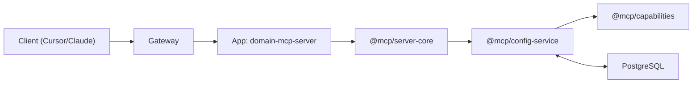

## MCP Server Pattern (Current)

Concise guide for creating and maintaining MCP servers in this monorepo.

### High-level

- Use `@mcp/server-core` factories
- Define only tool handlers in the app
- Prompts and resources are database-driven via `@mcp/config-service`
- Input schemas come from `@mcp/schemas` (JSON only)



### Minimal file structure

```
apps/<domain>-mcp-server/
├─ src/
│  ├─ config/config.ts            # server config
│  ├─ mcp-server/
│  │  ├─ handlers.ts              # business logic only
│  │  ├─ tools.ts                 # tool map + tool list
│  │  └─ http-server.ts           # uses server-core factory
│  └─ index.ts
└─ package.json
```

### Step 1 — Declare tools

```ts
// tools.ts
import * as handlers from "./handlers.js";

export function createToolHandlers() {
  return { my_tool: handlers.handleMyTool };
}

export function getAvailableTools() {
  return [{ name: "my_tool", description: "Do something", inputSchema: {} }];
}
```

### Step 2 — Implement handlers

```ts
// handlers.ts
export async function handleMyTool(_client: unknown, _params: unknown) {
  return { content: [{ type: "text", text: "ok" }] };
}
```

### Step 3 — Create the server

With external API client:

```ts
// http-server.ts
import type { FastifyInstance } from "fastify";
import { createMcpServerWithClient } from "@mcp/server-core";
import { createToolHandlers, getAvailableTools } from "./tools.js";
import { SomeApiClient } from "some-api-client";

export async function createDomainHttpServer(config: DomainServerConfig): Promise<FastifyInstance> {
  const client = new SomeApiClient({ apiKey: config.apiKey });
  return createMcpServerWithClient({
    serverName: "domain",
    serverKey: "domain",
    config,
    client,
    createToolHandlers,
    getAvailableTools,
  });
}
```

Without an API client:

```ts
import type { FastifyInstance } from "fastify";
import { createMcpServerWithoutClient } from "@mcp/server-core";
import { createToolHandlers, getAvailableTools } from "./tools.js";

export async function createDomainHttpServer(config: DomainServerConfig): Promise<FastifyInstance> {
  return createMcpServerWithoutClient({
    serverName: "domain",
    serverKey: "domain",
    config,
    createToolHandlers,
    getAvailableTools,
  });
}
```

### Step 4 — Register capability

- Add the server definition in `@mcp/capabilities` and export it from the registry.
- Gateway discovers servers from `@mcp/capabilities` and builds runtime config via
  `@mcp/config-service`.

### Conventions

- ESM + NodeNext; inter-package imports via `@mcp/...`; intra-package relative imports include `.js`
- Do not import Zod in app servers; consume JSON input schemas from `@mcp/schemas`
- Prompts/Resources are managed in the Admin UI and stored in the database (no static files)
