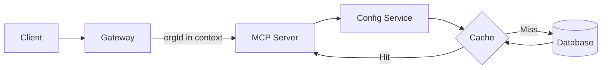

# Prompts & Resources Migration Plan

## Overview

This document outlines the migration from static, code-based prompts and resources to a dynamic,
database-driven system that supports organization-specific customization.

## Current Problems

1. **Configuration Drift**: Prompts/resources defined in multiple static files
2. **No Customization**: Can't modify per organization without code changes
3. **No Version Control**: Changes require deployments
4. **Scalability Issues**: No caching strategy, would hit DB on every request
5. **Maintenance Burden**: Updates require touching multiple files

## Migration Strategy

### Phase 1: Database Schema & Infrastructure ✅ (Completed)

- Added `OrganizationPrompt` and `OrganizationResource` tables
- Created `@mcp/config-service` with caching layer
- Implemented managers for loading configs with fallbacks

### Phase 2: Data Flow Architecture (Current)

#### 2.1 Organization Context Flow



#### 2.2 Caching Strategy

- **L1 Cache**: In-memory LRU cache in each MCP server (5 min TTL)
- **L2 Cache**: Redis cache shared across servers (15 min TTL)
- **Invalidation**: On config updates via Admin UI

#### 2.3 Read/Write Patterns

**Reads (High Volume)**:

1. Gateway adds orgId to request context
2. MCP Server checks L1 cache
3. If miss, Config Service checks L2 cache
4. If miss, load from DB and populate caches
5. Merge with defaults and return

**Writes (Low Volume)**:

1. Admin UI updates config in DB
2. Publish invalidation event to Redis
3. All servers invalidate L1 cache for that org
4. Next request repopulates caches

### Phase 3: Default Data Migration

#### 3.1 Seed Default Configurations

Create migration script to move all static prompts/resources to DB:

```typescript
// packages/database/prisma/seed-prompts-resources.ts
const DEFAULT_PROMPTS = {
  linear: {
    create_issue_workflow: {
      /* from linear/prompts.ts */
    },
    triage_workflow: {
      /* from linear/prompts.ts */
    },
    sprint_planning: {
      /* from linear/prompts.ts */
    },
  },
  perplexity: {
    /* ... */
  },
  devtools: {
    /* ... */
  },
};

const DEFAULT_RESOURCES = {
  linear: {
    "linear://teams": {
      /* from linear/resources.ts */
    },
    "linear://users": {
      /* from linear/resources.ts */
    },
  },
  // ...
};
```

#### 3.2 Global Defaults Table

Add a new table for system-wide defaults:

```prisma
model DefaultPrompt {
  id          String   @id @default(cuid())
  mcpServerId String
  name        String
  description String
  template    Json
  arguments   Json

  mcpServer McpServer @relation(...)

  @@unique([mcpServerId, name])
}

model DefaultResource {
  id          String   @id @default(cuid())
  mcpServerId String
  uri         String
  name        String
  description String
  mimeType    String?
  metadata    Json?

  mcpServer McpServer @relation(...)

  @@unique([mcpServerId, uri])
}
```

### Phase 4: Server Core Updates

#### 4.1 Context Propagation

Update server-core to accept and propagate organization context:

```typescript
// packages/server-core/src/config.ts
export interface RequestContext {
  organizationId?: string;
  userId?: string;
  sessionId?: string;
}

export interface ServerCreationOptions<TClient = unknown> {
  // ... existing
  configService?: IConfigService; // New
}
```

#### 4.2 Dynamic Handler Loading

Replace static handlers with dynamic ones:

```typescript
// packages/server-core/src/http-server.ts
async function routeRequest(
  method: string,
  params: unknown,
  id: string | number | undefined,
  context: RequestContext, // New parameter
  handlers: HandlerRegistries
) {
  // Load prompts/resources based on context
  if (context.organizationId && handlers.configService) {
    handlers.promptHandlers = await handlers.configService.loadPrompts(context);
    handlers.resourceHandlers = await handlers.configService.loadResources(context);
  }
  // ... rest of routing logic
}
```

### Phase 5: Gateway Integration

#### 5.1 Extract Organization Context

Update gateway to extract and pass organization context:

```typescript
// apps/gateway/src/gateway/protocol-adapter.ts
private extractContext(request: FastifyRequest): RequestContext {
  // Extract from JWT, headers, or session
  return {
    organizationId: request.headers['x-organization-id'],
    userId: request.user?.id,
    sessionId: request.session?.id
  };
}
```

#### 5.2 Pass Context to MCP Servers

Include context in all MCP server requests:

```typescript
// apps/gateway/src/gateway/server-manager.ts
async forwardRequest(serverUrl: string, request: MCPRequest, context: RequestContext) {
  const enrichedRequest = {
    ...request,
    context // Add context to request
  };
  // Forward to MCP server
}
```

### Phase 6: Remove Static Files

Once everything is working:

1. Remove all `prompts.ts` and `resources.ts` files
2. Update imports to use config service
3. Remove static definitions from utils
4. Clean up unused types

## Benefits

1. **Single Source of Truth**: Database is the only place configs live
2. **Organization Customization**: Each org can have custom prompts/resources
3. **Version Control**: Track changes with audit logs
4. **Hot Reloading**: Changes take effect without deployment
5. **Scalability**: Multi-layer caching for performance
6. **Maintainability**: Centralized configuration management

## Rollback Strategy

If issues arise:

1. Feature flag to disable dynamic loading
2. Fall back to static configs
3. Cache can be cleared instantly
4. Database changes are reversible

## Monitoring

Track:

- Cache hit rates (target: >90%)
- Database query times
- Config load times
- Error rates on config loading
