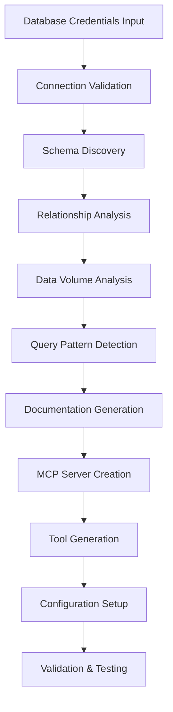

# 🤖 Database-to-MCP-Server Agent

> Automated agent that scans any SQL database and generates a fully functional MCP server with comprehensive schema documentation and query tools.

## 🎯 **Agent Overview**

This agent automates the complete process of database discovery, analysis, and MCP server generation. It connects to any SQL database, explores the schema, analyzes relationships and data patterns, then generates a production-ready MCP server with appropriate tools.

## 📋 **Process Flow**



## 🔧 **Implementation Steps**

### **Phase 1: Input & Validation**

#### **1.1 Database Credentials Collection**

```typescript
interface DatabaseCredentials {
  type: "postgresql" | "mysql" | "sqlite" | "mssql" | "oracle";
  host: string;
  port: number;
  database: string;
  username: string;
  password: string;
  schema?: string;
  ssl?: boolean;
  connectionTimeout?: number;
}

interface AgentConfig {
  serverName: string;
  description: string;
  author: string;
  outputPath?: string;
  includeAnalytics?: boolean;
  generateSampleQueries?: boolean;
  securityMode: "read-only" | "read-write" | "admin";
}
```

#### **1.2 Connection Validation**

```sql
-- Test queries for different database types
PostgreSQL: SELECT version(), current_database(), current_schema();
MySQL: SELECT VERSION(), DATABASE(), USER();
SQLite: SELECT sqlite_version();
```

### **Phase 2: Schema Discovery**

#### **2.1 Table Discovery**

```sql
-- PostgreSQL Information Schema Queries
SELECT
    t.table_name,
    t.table_type,
    obj_description(c.oid) as table_comment
FROM information_schema.tables t
LEFT JOIN pg_class c ON c.relname = t.table_name
WHERE t.table_schema = 'public'
    AND t.table_type = 'BASE TABLE'
ORDER BY t.table_name;
```

#### **2.2 Column Analysis**

```sql
-- Comprehensive column information
SELECT
    c.table_name,
    c.column_name,
    c.data_type,
    c.is_nullable,
    c.column_default,
    c.character_maximum_length,
    c.numeric_precision,
    c.numeric_scale,
    CASE WHEN pk.column_name IS NOT NULL THEN true ELSE false END as is_primary_key,
    col_description(pgc.oid, c.ordinal_position) as column_comment
FROM information_schema.columns c
LEFT JOIN (
    SELECT ku.table_name, ku.column_name
    FROM information_schema.table_constraints tc
    JOIN information_schema.key_column_usage ku
        ON tc.constraint_name = ku.constraint_name
    WHERE tc.constraint_type = 'PRIMARY KEY'
) pk ON c.table_name = pk.table_name AND c.column_name = pk.column_name
LEFT JOIN pg_class pgc ON pgc.relname = c.table_name
WHERE c.table_schema = 'public'
ORDER BY c.table_name, c.ordinal_position;
```

#### **2.3 Relationship Discovery**

```sql
-- Foreign key relationships
SELECT
    tc.table_name,
    kcu.column_name,
    ccu.table_name AS foreign_table_name,
    ccu.column_name AS foreign_column_name,
    rc.delete_rule,
    rc.update_rule
FROM information_schema.table_constraints AS tc
JOIN information_schema.key_column_usage AS kcu
    ON tc.constraint_name = kcu.constraint_name
JOIN information_schema.constraint_column_usage AS ccu
    ON ccu.constraint_name = tc.constraint_name
JOIN information_schema.referential_constraints rc
    ON tc.constraint_name = rc.constraint_name
WHERE tc.constraint_type = 'FOREIGN KEY'
ORDER BY tc.table_name, kcu.column_name;
```

#### **2.4 Index Discovery**

```sql
-- Index analysis for query optimization
SELECT
    schemaname,
    tablename,
    indexname,
    indexdef
FROM pg_indexes
WHERE schemaname = 'public'
ORDER BY tablename, indexname;
```

### **Phase 3: Data Analysis**

#### **3.1 Volume Analysis**

```sql
-- Row counts and table sizes
SELECT
    schemaname,
    tablename,
    n_live_tup as estimated_rows,
    pg_size_pretty(pg_total_relation_size(schemaname||'.'||tablename)) as total_size
FROM pg_stat_user_tables
WHERE schemaname = 'public'
ORDER BY n_live_tup DESC;
```

#### **3.2 Data Pattern Detection**

```typescript
// Analyze column patterns to suggest query types
interface ColumnPattern {
  name: string;
  type: string;
  pattern:
    | "id"
    | "name"
    | "email"
    | "date"
    | "amount"
    | "status"
    | "text"
    | "json";
  suggestedQueries: string[];
}

// Pattern recognition logic
function detectColumnPatterns(columns: Column[]): ColumnPattern[] {
  return columns.map((col) => ({
    name: col.name,
    type: col.data_type,
    pattern: inferPattern(col),
    suggestedQueries: generateQuerySuggestions(col),
  }));
}
```

#### **3.3 Business Logic Detection**

```sql
-- Detect common business patterns
-- Many-to-many relationships
-- Audit trails (created_at, updated_at)
-- Soft deletes (deleted_at, is_active)
-- Status fields
-- Hierarchical data (parent_id)
```

### **Phase 4: Documentation Generation**

#### **4.1 Schema Reference Document**

```typescript
interface DatabaseReference {
  overview: {
    databaseType: string;
    version: string;
    totalTables: number;
    totalRecords: number;
    estimatedSize: string;
  };
  tables: TableDefinition[];
  relationships: RelationshipMap[];
  queryPatterns: QueryPattern[];
  businessRules: BusinessRule[];
  suggestedTools: MCPTool[];
}
```

#### **4.2 Query Pattern Library**

```typescript
// Auto-generate common query patterns based on schema
const queryPatterns = [
  // CRUD operations for each table
  // JOIN queries based on foreign keys
  // Aggregation queries for numeric columns
  // Search queries for text columns
  // Time-series queries for date columns
  // Analytics queries for business metrics
];
```

### **Phase 5: MCP Server Generation**

#### **5.1 Server Scaffolding**

```bash
# Use existing CLI with dynamic parameters
pnpm omni create
# Inputs: server name, description, author, port (auto-detected)
```

#### **5.2 Tool Generation**

```typescript
// Generate MCP tools based on discovered schema
interface GeneratedTool {
  name: string;
  description: string;
  parameters: ToolParameter[];
  handler: string; // Generated handler code
  examples: QueryExample[];
}

// Tool categories to generate:
const toolCategories = [
  "table_query", // SELECT * FROM table WHERE...
  "table_search", // Full-text or LIKE searches
  "table_count", // COUNT queries
  "relationship_join", // JOIN operations
  "aggregation", // SUM, AVG, GROUP BY
  "analytics", // Business intelligence queries
  "schema_info", // Metadata queries
];
```

#### **5.3 Handler Code Generation**

```typescript
// Auto-generate handler functions
function generateHandler(table: Table, operation: string): string {
  return `
export async function handle${pascalCase(table.name)}${pascalCase(
    operation
  )}(params: unknown) {
  const schema = z.object({
    ${generateZodSchema(table, operation)}
  });
  
  const validated = schema.safeParse(params);
  if (!validated.success) {
    throw new Error(\`Invalid parameters: \${validated.error.message}\`);
  }
  
  const query = \`${generateSQL(table, operation)}\`;
  const result = await executeQuery(query, validated.data);
  
  return {
    content: [{
      type: "text",
      text: JSON.stringify(result, null, 2)
    }]
  };
}`;
}
```

### **Phase 6: Configuration & Security**

#### **6.1 Environment Configuration**

```bash
# Generated .env.example
DATABASE_TYPE=postgresql
DATABASE_HOST=localhost
DATABASE_PORT=5432
DATABASE_NAME=discovered_db
DATABASE_USER=username
DATABASE_PASSWORD=password
DATABASE_SCHEMA=public
DATABASE_SSL=false
DATABASE_POOL_SIZE=10
DATABASE_TIMEOUT=30000

# Security settings
QUERY_TIMEOUT=30000
MAX_ROWS_LIMIT=1000
READ_ONLY_MODE=true
ALLOWED_OPERATIONS=select,count,analyze
```

#### **6.2 Security Validation**

```typescript
// Built-in SQL injection protection
const securityRules = [
  "no-drop-statements",
  "no-delete-without-where",
  "no-update-without-where",
  "row-limit-enforcement",
  "query-timeout-enforcement",
  "whitelist-operations-only",
];
```

### **Phase 7: Testing & Validation**

#### **7.1 Generated Test Suite**

```typescript
// Auto-generate tests for each tool
describe("Generated MCP Tools", () => {
  test("table queries work correctly", async () => {
    // Test basic SELECT operations
  });

  test("relationship joins function properly", async () => {
    // Test foreign key JOINs
  });

  test("security constraints are enforced", async () => {
    // Test malicious query prevention
  });
});
```

#### **7.2 Health Checks**

```typescript
// Generated health check endpoints
const healthChecks = [
  "database-connection",
  "schema-accessibility",
  "query-performance",
  "security-validation",
];
```

## 🚀 **Agent Implementation**

### **CLI Command**

```bash
# New CLI command for the agent
pnpm omni discover-database

# Interactive prompts:
# - Database connection details
# - Server configuration
# - Security preferences
# - Tool generation options
```

### **Agent Flow**

```typescript
class DatabaseToMCPAgent {
  async discover(credentials: DatabaseCredentials, config: AgentConfig) {
    // Phase 1: Connect and validate
    const connection = await this.connect(credentials);

    // Phase 2: Discover schema
    const schema = await this.discoverSchema(connection);

    // Phase 3: Analyze patterns
    const analysis = await this.analyzeDatabase(schema);

    // Phase 4: Generate documentation
    const docs = await this.generateDocumentation(analysis);

    // Phase 5: Create MCP server
    const serverPath = await this.createMCPServer(config);

    // Phase 6: Generate tools and handlers
    await this.generateTools(analysis, serverPath);

    // Phase 7: Configure and test
    await this.configureAndTest(credentials, serverPath);

    return {
      serverPath,
      documentation: docs,
      tools: analysis.suggestedTools,
      ready: true,
    };
  }
}
```

## 🎯 **Output Structure**

```
servers/discovered-database-mcp-server/
├── SCHEMA_REFERENCE.md              # Auto-generated documentation
├── QUERY_PATTERNS.md                # Common query examples
├── src/
│   ├── mcp-server/
│   │   ├── handlers.ts              # Generated tool handlers
│   │   ├── database.ts              # Connection management
│   │   ├── security.ts              # Query validation
│   │   └── queries/                 # Pre-built query templates
│   │       ├── table-operations.ts
│   │       ├── relationships.ts
│   │       ├── analytics.ts
│   │       └── search.ts
│   └── types/
│       ├── database.ts              # Generated TypeScript types
│       └── tools.ts                 # Tool parameter types
├── tests/
│   ├── handlers.test.ts             # Generated test suite
│   └── security.test.ts             # Security validation tests
└── config/
    ├── database-schema.json         # Discovered schema metadata
    └── tool-definitions.json        # Generated tool configurations
```

## 🔒 **Security Considerations**

- **Read-only by default**: Generated servers default to SELECT-only operations
- **Query validation**: All queries validated against whitelist patterns
- **Row limits**: Automatic LIMIT clauses to prevent large data dumps
- **Timeout enforcement**: Query execution time limits
- **SQL injection prevention**: Parameterized queries only
- **Schema isolation**: Access limited to specified schema/database

## 🎉 **Benefits**

✅ **Zero Manual Setup**: Complete automation from credentials to working MCP server  
✅ **Comprehensive Documentation**: Auto-generated schema reference and query examples  
✅ **Security-First**: Built-in protections against common vulnerabilities  
✅ **Type Safety**: Generated TypeScript types for all database entities  
✅ **Production Ready**: Includes tests, health checks, and monitoring  
✅ **Extensible**: Easy to add custom tools and modify generated code

This agent would transform database integration from hours of manual work to minutes of automated discovery and generation!
